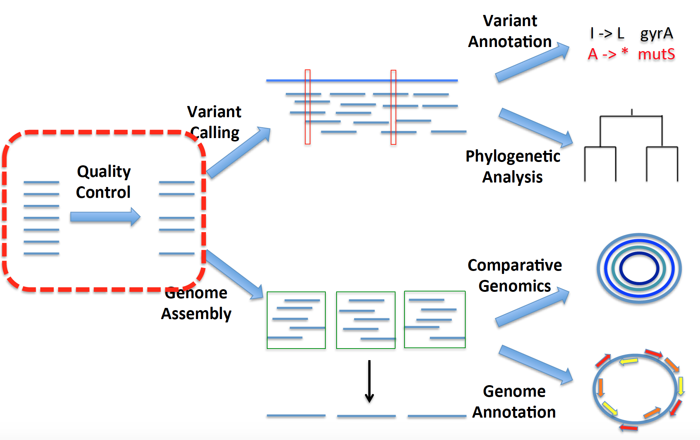

Class 5 – Illumina sequencing data and QC
=========================================

Goal
----

- We discuss the fastq sequence format, that contains information on sequence and it's associated quality scores
- We will explore the output from kraken, which is used to detect contamination of in our sequencing data
- We will explore the output of FastQC, which is used to evaluate the quality of our sequencing data
- We will clean reads by removing low quality reads and adapters using Trimmomatic, and check its performance using FastQC

Overview of Genomics Pipeline
-----------------------------
Now that we're getting into genomic analysis, let's come back to the overview of the analysis workflow. The first step leading to all downstream analyses is data quality control (QC), which is what we will cover today.




Contamination Screening using [Kraken](https://ccb.jhu.edu/software/kraken/)
--------------------------------------------
One important QC to perform when getting your sequencing data is to make sure you sequenced what you think you did. For this purpose, we will employ Kraken which is a taxonomic sequence classifier that assigns taxonomic labels to short DNA reads. We will screen our samples against a MiniKraken database (a pre-built database constructed from complete bacterial, archaeal, and viral genomes in NCBI RefSeq database) and confirm if the majority of reads in our sample belong to the target species.

All the tools that you would need for class5 QC are installed in your Conda environment MICRO582_class5_QC. If you have not created the conda environment, please run the commands described in class3 section -  [Set up a conda environment using a YML file](https://github.com/Snitkin-Lab-Umich/MICRO582-EPI582-Winter-2024/blob/main/class/class4/README.md#set-up-a-conda-environment-using-a-yml-file)

Lets load the conda environment and check if we can call kraken help menu.

```
conda activate MICRO582_class5_QC


kraken -h
```

If you see the help menu, then we are all set to move forward.

> ***i. Login to an interactive cluster node so that we are not all running intensive commands on the login node***

When we previously used the cluster we created an sbat file and included specifications for the resources desired and the commands/programs we wanted to execute on a cluster node with the desired specs. Here we will be working with the cluster in a different way, by creating an interactive cluster job. In essence, gettng an interactive node allows you to login to a cluster node, so you can run commands on a compute system with the desired resources. This is desirable when your job requires a lot of input from you (e.g. testing code, working in R, etc.) or if you want to closely monitor a jobs running behavior. 

To submit an interactive job we will use an alias that we placed in our .bashrc called 'islurm'. When you type islurm, the following command will be executed:

```
srun --account=epid582w24_class --nodes=1 --ntasks-per-node=1 --mem-per-cpu=5GB --cpus-per-task=1 --time=05:00:00 --pty /bin/bash
```

***When you run islurm what happens?***

***How can you tell that you are now executing commands on a cluster node?***

***How can we verify that indeed we are running a job on the cluster?***

You should see "username@glXXXX" in your command prompt where XXXX refers to the cluster node number.

> ***ii. Copy class5 directory to your home directory***

```
#Go to your class working directory
wd

#Copy over today's materials
cp -r /scratch/epid582w24_class_root/epid582w24_class/shared_data/data/class5 ./

#Go into the directory
cd class5/

```

> **iii. Lets run kraken on Rush_KPC_266_1_combine.fastq.gz file before we assess it quality***

Since Kraken takes time to run, we have already placed the output of Kraken command in class5 directory. Here is the command that we ran:

```

kraken --quick --fastq-input --gzip-compressed --unclassified-out Rush_KPC_266_unclassified.txt --db kraken/minikraken_20171013_4GB/ --output Rush_KPC_266_kraken Rush_KPC_266_1_combine.fastq.gz 

```

> **iv. Run Kraken report to generate a concise summary report of the species found in reads file.***
After running kraken, we ran the kraken-report command to create a human readable text file containing the output.

```

kraken-report --db kraken/minikraken_20171013_4GB/ Rush_KPC_266_kraken > Rush_KPC_266_kraken_report.txt

```

The output of kraken-report is tab-delimited, with one line per taxon. The fields of the output, from left-to-right, are as follows:

1. Percentage of reads covered by the clade rooted at this taxon
2. Number of reads covered by the clade rooted at this taxon
3. Number of reads assigned directly to this taxon
4. A rank code, indicating (U)nclassified, (D)omain, (K)ingdom, (P)hylum, (C)lass, (O)rder, (F)amily, (G)enus, or (S)pecies. All other ranks are simply '-'.
5. NCBI taxonomy ID
6. indented scientific name


```
less Rush_KPC_266_kraken_report.txt
```

Lets extract columns by Species and check the major species indentified in our sample. To do this we searched for lines that have a column with only an S (will only happen for lines that have species level classification in column 4). Note that the search is for tab + S + tab, because it's a tab delimited file. To type tab at the command line, you need to first type ctl-v, and then tab.

```
grep "        S       " Rush_KPC_266_kraken_report.txt | head

```


> v. Generate a HTML report to visualize Kraken report using Krona
To enable easier interaction with the results, kraken comes with a companion tool called krona. To translate the kraken report into a nice html, we ran the following two commands.

```
cut -f2,3 Rush_KPC_266_kraken > Rush_KPC_266_krona.input

ktImportTaxonomy -tax /scratch/epid582w24_class_root/epid582w24_class/shared_data/bin/KronaTools-2.8.1/taxonomy/ Rush_KPC_266_krona.input -o Rush_KPC_266_krona.out.html
```

In case you get an error saying - Taxonomy not found, run updateTaxonomy.sh command.

```
ktUpdateTaxonomy.sh
```

Use cyberduck or the scp command as shown below to copy over the Kraken/krona html report to your local system.

***Note: Run this scp command on your local system and not on great lakes.***

```

scp username@greatlakes-xfer.arc-ts.umich.edu:/scratch/epid582w24_class_root/epid582w24_class/shared_data/data/class5/kraken_results/Rush_KPC_266_krona.out.html /path-to-local-directory/

#You can use ~/Desktop/ as your local directory path

```

Quality Control using FastQC
----------------------------
OK, you've verified that you sequenced the correct thing using Kraken and are eager to dig into your data and see what it reveals. However, before you get to analyzing, you first need to make sure that the data are of good enough quality to warrent further analysis, and to ensure that you don't get led astray by messy data. 

We will be performing QC analysis on Illumina sequencing data (see [here](https://youtu.be/fCd6B5HRaZ8)). The tool that we will be using to examine the quality of our sequencing data is FastQC. FastQC is a quality control tool that reads in sequence data in a variety of formats(fastq, bam, sam) and can either provide an interactive application to review the results or create an HTML based report which can be integrated into any pipeline. Running FastQC can give you quick sense of the data quality and whether it exhibits any unusual properties (e.g. contamination or unexpected biological features), and can point you towards next steps in terms of ways to cleanup your data.


> ***i. Go to class5 directory and create a new directory for saving FastQC results.***

As with kraken, we have pre-run fastqc for you, but here are the steps that we took.

```
#Go back to your class5 working directory
wd

cd class5/

#Create directory for FastQC results
mkdir Rush_KPC_266_FastQC_results

#Create directory for trimmomatic results
mkdir Rush_KPC_266_FastQC_results/before_trimmomatic
```

> ***ii. Verify that FastQC is in your path by invoking it from command line.***

```
#Active conda environment giving us access to fastqc
conda activate MICRO582_class5_QC

#Verify that you can run fastqc
fastqc -h
```

FastQC can be run in two modes: "command line" or as a GUI (graphical user interface). We will be using command line version of it.

> ***iii. Run FastQC to generate quality report of sequence reads.***

```
fastqc -o Rush_KPC_266_FastQC_results/before_trimmomatic/ Rush_KPC_266_1_combine.fastq.gz Rush_KPC_266_2_combine.fastq.gz --extract
```

This will generate two results directory, Rush_KPC_266_1_combine_fastqc and Rush_KPC_266_2_combine_fastqc in output folder Rush_KPC_266_FastQC_results/before_trimmomatic/ provided with -o flag. 

The summary.txt file in these directories indicates if the data passed different quality control tests in text format.

You can visualize and assess the quality of data by opening html report in a local browser.

> ***iv. Download the FastQC html report to your home computer to examine using scp***

```
scp username@greatlakes-xfer.arc-ts.umich.edu:/scratch/epid582w24_class_root/epid582w24_class/username/class5/Rush_KPC_266_FastQC_results/before_trimmomatic/*.html /path-to-local-directory/

```

The analysis in FastQC is broken down into a series of analysis modules. The left hand side of the main interactive display or the top of the HTML report show a summary of the modules which were run, and a quick evaluation of whether the results of the module seem entirely normal (green tick), slightly abnormal (orange triangle) or very unusual (red cross). 


Lets first look at the quality drop(per base sequence quality graph) at the end of "Per Base Sequence Quality" graph. This degredation of quality towards the end of reads is commonly observed in illumina samples. The reason for this drop is that as the number of sequencing cycles performed increases, the average quality of the base calls, as reported by the Phred Scores produced by the sequencer falls. 

Next, lets check the overrepresented sequences graph and the kind of adapters that were used for sequencing these samples (Truseq or Nextera) which comes in handy while indicating the adapter database path during downstream filtering step (Trimmomatic).


- Check out [this](https://sequencing.qcfail.com/articles/loss-of-base-call-accuracy-with-increasing-sequencing-cycles/) for more detailed explaination as to why quality drops with increasing sequencing cycles.

- [A video FastQC walkthrough created by FastQC developers](https://www.youtube.com/watch?v=bz93ReOv87Y "FastQC video") 

Quality Trimming using [Trimmomatic](http://www.usadellab.org/cms/?page=trimmomatic "Trimmomatic Homepage")
------------------------------------

Filtering out problematic sequences within a dataset is inherently a trade off between sensitivity (ensuring all contaminant sequences are removed) and specificity (leaving all non-contaminant sequence data intact). Adapter and other technical contaminants can potentially occur in any location within the reads.(start, end, read-through (between the reads), partial adapter sequences)

Trimmomatic is a tool that tries to search these potential contaminant/adapter sequence within the read at all the possible locations. It takes advantage of the added evidence available in paired-end dataset. In paired-end data, read-through/adapters can occur on both the forward and reverse reads of a particular fragment in the same position. Since the fragment was entirely sequenced from both ends, the non-adapter portion of the forward and reverse reads will be reverse-complements of each other. This strategy of searching for contaminant in both the reads is called 'palindrome' mode. 

For more information on how Trimmomatic tries to achieve this, Please refer [this](http://www.usadellab.org/cms/uploads/supplementary/Trimmomatic/TrimmomaticManual_V0.32.pdf) manual.

Now we will run Trimmomatic on these raw data to remove low quality reads as well as adapters. 

> ***i. If the interactive session timed out, get an interactive cluster node again (using alias `islurm`) to start running programs and navigate to class4 directory. Also, load the Conda environment - MICRO582_class5_QC.***

Run this only if you were logged out of interactive mode.

```
conda activate MICRO582_class5_QC

wd

cd class5
```

> ***ii. Create these output directories in your day1pm folder to save trimmomatic results***

```
mkdir Rush_KPC_266_trimmomatic_results
```

> ***iii. Try to invoke trimmomatic from command line.***

```

trimmomatic –h

```

> ***iv. Run the below trimmomatic commands on raw reads.***

```

trimmomatic PE Rush_KPC_266_1_combine.fastq.gz Rush_KPC_266_2_combine.fastq.gz Rush_KPC_266_trimmomatic_results/forward_paired.fq.gz Rush_KPC_266_trimmomatic_results/forward_unpaired.fq.gz Rush_KPC_266_trimmomatic_results/reverse_paired.fq.gz Rush_KPC_266_trimmomatic_results/reverse_unpaired.fq.gz ILLUMINACLIP:/scratch/epid582w24_class_root/epid582w24_class/shared_data/data/database/trimmomatic-0.39-2/adapters/TruSeq3-PE.fa:2:30:10:8:true SLIDINGWINDOW:4:15 MINLEN:40 HEADCROP:0

```


First, Trimmomatic searches for any matches between the reads and adapter sequences. Adapter sequences are stored in this directory of Trimmomatic tool: /scratch/epid582w24_class_root/epid582w24_class/shared_data/database/trimmomatic-0.39-1/adapters/. Trimmomatic comes with a list of standard adapter fasta sequences such TruSeq, Nextera etc. You should use appropriate adapter fasta sequence file based on the illumina kit that was used for sequencing. You can get this information from your sequencing centre or can find it in FastQC html report (Section: Overrepresented sequences).

Short sections (2 bp as determined by seed misMatch parameter) of each adapter sequences (contained in TruSeq3-PE.fa) are tested in each possible position within the reads. If it finds a perfect match, It starts searching the entire adapter sequence and scores the alignment. The advantage here is that the full alignment is calculated only when there is a perfect seed match which results in considerable efficiency gains. So, When it finds a match, it moves forward with full alignment and when the match reaches 10 bp determined by simpleClipThreshold, it finally trims off the adapter from reads.  

Quoting Trimmomatic:

"'Palindrome' trimming is specifically designed for the case of 'reading through' a short fragment into the adapter sequence on the other end. In this approach, the appropriate adapter sequences are 'in silico ligated' onto the start of the reads, and the combined adapter+read sequences, forward and reverse are aligned. If they align in a manner which indicates 'read- through' i.e atleast 30 bp match, the forward read is clipped and the reverse read dropped (since it contains no new data)."

> ***v. Now create new directories in day1pm folder and Run FastQC on these trimmomatic results.***

```
mkdir Rush_KPC_266_FastQC_results/after_trimmomatic

fastqc -o Rush_KPC_266_FastQC_results/after_trimmomatic/ Rush_KPC_266_trimmomatic_results/forward_paired.fq.gz Rush_KPC_266_trimmomatic_results/reverse_paired.fq.gz --extract
```

Get these html reports to your local system.

```

scp username@greatlakes-xfer.arc-ts.umich.edu:/scratch/epid582w24_class_root/epid582w24_class/username/class5/Rush_KPC_266_FastQC_results/after_trimmomatic/*.html /path-to-local-directory/

```


After running Trimmomatic, you should notice that the sequence quality improved (Per base sequence quality) and now it doesn't contain any contaminants/adapters (Overrepresented sequences).

Next, take a look at the per base sequence content graph, and notice that the head bases(~9 bp) are slightly imbalanced. In a perfect scenario, each nucleotide content should run parallel to each other, and should be reflective of the overall A/C/T/G content of your input sequence. 

Quoting FastQC:
	"It's worth noting that some types of library will always produce biased sequence composition, normally at the start of the read. Libraries produced by priming using random hexamers (including nearly all RNA-Seq libraries) and those which were fragmented using transposases inherit an intrinsic bias in the positions at which reads start. This bias does not concern an absolute sequence, but instead provides enrichment of a number of different K-mers at the 5' end of the reads. Whilst this is a true technical bias, it isn't something which can be corrected by trimming and in most cases doesn't seem to adversely affect the downstream analysis. It will however produce a warning or error in this module."

This doesn't look very bad but you can remove the red cross sign by trimming these imbalanced head bases using HEADCROP:9 flag in the above command. This removes the first 9 bases from the start of the read. Often, the start of the read is not good quality, which is why this improves the overall read quality.

> ***vi. Lets Run trimmomatic again with headcrop 9 and save it in a different directory called Rush_KPC_266_trimmomatic_results_with_headcrop/***

```
mkdir Rush_KPC_266_trimmomatic_results_with_headcrop/


time trimmomatic PE Rush_KPC_266_1_combine.fastq.gz Rush_KPC_266_2_combine.fastq.gz Rush_KPC_266_trimmomatic_results_with_headcrop/forward_paired.fq.gz Rush_KPC_266_trimmomatic_results_with_headcrop/forward_unpaired.fq.gz Rush_KPC_266_trimmomatic_results_with_headcrop/reverse_paired.fq.gz Rush_KPC_266_trimmomatic_results_with_headcrop/reverse_unpaired.fq.gz ILLUMINACLIP:/scratch/epid582w24_class_root/epid582w24_class/shared_data/database/trimmomatic-0.39-1/adapters/TruSeq3-PE.fa:2:30:10:8:true SLIDINGWINDOW:4:20 MINLEN:40 HEADCROP:9

```

Unix gem: time in above command shows how long a command takes to run?

> ***vii. Run FastQC 'one last time' on updated trimmomatic results with headcrop and check report on your local computer***

```
mkdir Rush_KPC_266_FastQC_results/after_trimmomatic_headcrop/

fastqc -o Rush_KPC_266_FastQC_results/after_trimmomatic_headcrop/ --extract -f fastq Rush_KPC_266_trimmomatic_results_with_headcrop/forward_paired.fq.gz Rush_KPC_266_trimmomatic_results_with_headcrop/reverse_paired.fq.gz
```
Download the reports again and see the difference.
```

scp username@greatlakes-xfer.arc-ts.umich.edu:/scratch/epid582w24_class_root/epid582w24_class/username/class5/Rush_KPC_266_FastQC_results/after_trimmomatic_headcrop/*.html /path-to-local-directory/

```

The red cross sign disappeared!

Lets have a look at one of the Bad Illumina data example [here](http://www.bioinformatics.babraham.ac.uk/projects/fastqc/bad_sequence_fastqc.html)

