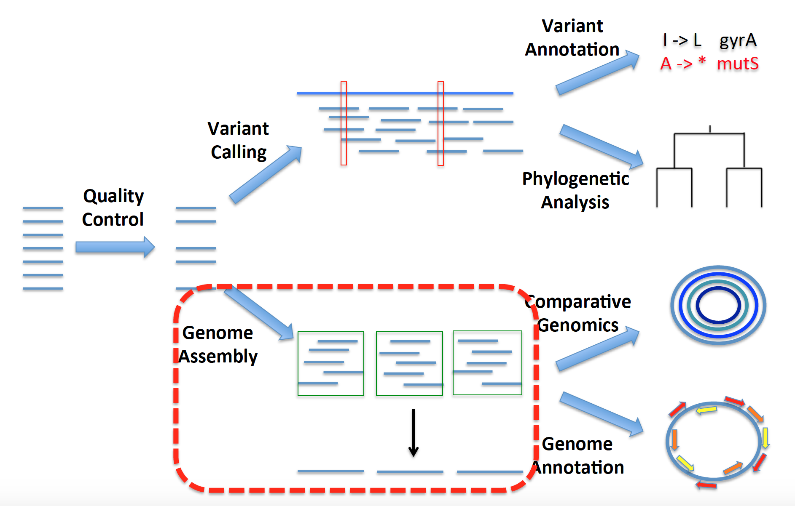
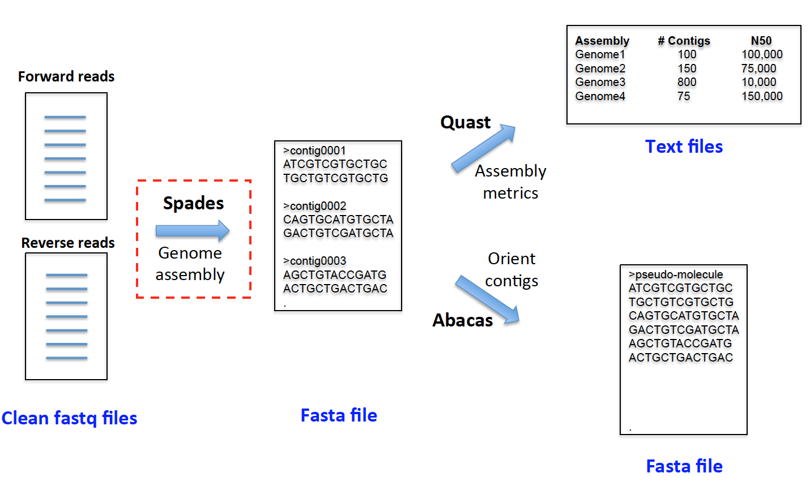

Class 5 – Genome assembly
=========================

Goal
----

- Assemble short reads illumina data into a genomic assembly using Spades Assembler
- Assess the quality of genome assemblies with Quast.
- Generate multiple sample report that integrates output of Quast, Kraken and FastQC to streamline quality control.




Execute the following command to copy files for today's exercises to your workshop home directory: 

```
> Note: Make sure you change 'username' in the commands below to your 'uniqname'. 

wd

#or 

cd /scratch/epid582w23_class_root/epid582w23_class/username


> Note: Copy files for today's exercise in your home directory.

cp -r /scratch/epid582w23_class_root/epid582w23_class/shared_data/data/class5 ./
```

Genome Assembly using [Spades](http://bioinf.spbau.ru/spades) Pipeline
------------------------------


There are a wide range of tools available for the assembly of microbial genomes. These assemblers fall in to two general algorithmic categories, which you can learn more about [here](?). In the end, most assemblers will perform well on microbial genomes, unless there is unusually high GC-content or an over-abundance of repetitive sequences, both of which make accurate assembly difficult.

Here we will use the Spades assembler with default parameters. Because genome assembly is a computationally intensive process, we will submit our assembly jobs to the cluster, and move ahead with some pre-assembled genomes, while your assemblies are running.



> ***i. Create directory to hold your assembly output.***

Create a new directory for the spades output in your class_5 folder

```
> Note: Make sure you change 'username' in the below command with your 'uniqname'. 

cd /scratch/epid582w23_class_root/epid582w23_class/username/class5

> We will create a new directory in class_5 to save genome assembly results:

mkdir MSSA_SRR5244781_assembly_result 

```

Now, we will use a genome assembly tool called Spades for assembling the reads.

> ***ii. Test out Spades to make sure it's in your path***

Lets load spades module from the Great lakes provided Bioinformatics Modules.

```
> check if spades is working. 

module load Bioinformatics
module load spades

spades.py -h  

```

> ***iii. Submit a cluster job to assemble***

Since it takes a huge amount of memory and time to assemble genomes using spades, we will run a slurm script on great lakes cluster for this step.

Now, open the spades.sbat file residing in the class_5 folder with nano. Replace the EMAIL_ADDRESS in spades.sbat file with your actual email-address. This will make sure that whenever the job starts, aborts or ends, you will get an email notification.

```
> Open the spades.sbat file using nano:

nano spades.sbat

> Now replace the EMAIL_ADDRESS in spades.sbat file with your actual email-address. This will make sure that whenever the job starts, aborts or ends, you will get an email notification.

> Examine the spades command to perform the assembly

spades.py -1 forward_paired.fq.gz -2 reverse_paired.fq.gz -o MSSA_SRR5244781_assembly_result/ --careful

```

> ***iv. Submit your job to the cluster with sbatch***

```
sbatch spades.sbat
```

> ***v. Verify that your job is in the queue with the squeue command***

```
squeue -u username 
```

### SPAdes output

SPAdes stores all output files in `<output_dir> `, which is set by the user. It generate various intermediate files that can be further used to explore the assembled genome in graphical format. For this class, we will be focusing on the final genome fasta file that was assembled by Spades. After the SPAdes job is done, it will save the assembled genome in `<output_dir>/contigs.fasta` file which we have already placed in the class5 folder and renamed it to `SRR5244781_contigs.fasta`.  


We will now evaluate SRR5244781_contigs.fasta and SRR5244821_contigs.fasta assemblies using Quast.

Assembly evaluation using [QUAST](http://bioinf.spbau.ru/quast)
---------------------------------

The output of an assembler is a set of contigs (contiguous sequences), that are composed of the short reads that we fed in. Once we have an assembly we want to evaluate how good it is. This is somewhat qualitative, but there are some standard metrics that people use to quantify the quality of their assembly. Useful metrics include: i) number of contigs (the fewer the better), ii) N50 (the minimum contig size that at least 50% of your assembly belongs, the bigger the better). In general you want your assembly to be less than 200 contigs and have an N50 greater than 50 Kb, although these numbers are highly dependent on the properties of the assembled genome. 

To evaluate some example assemblies we will use the tool quast. Quast produces a series of metrics describing the quality of your genome assemblies. 


> ***i. Run quast on a set of previously generated assemblies***

Now to check the example assemblies residing in your class5 folder, run the below quast command. Make sure you are in class5 folder in your home directory using 'pwd'


```
quast.py -o quast SRR5244781_contigs.fasta SRR5244821_contigs.fasta
```

The command above will generate a report file in /scratch/epid582w23_class_root/epid582w23_class/username/class5/quast

> ***ii. Explore quast output***

QUAST creates output in different formats such as html, pdf and text. Now lets check the report.txt file residing in quast folder for assembly statistics. Open report.txt using nano.

```
less quast/report.txt
```

Check the difference between the different assembly statistics. Also check the different types of report it generated.

Generating multiple sample reports using [multiqc](http://multiqc.info/)
--------------------------------------------------


Let's imagine a real-life scenario where you are working on a project which requires you to analyze and process hundreds of samples. Having a few samples with extremely bad quality is very commonplace. Including these bad samples into your analysis without adjusting their quality threshold can have a profound effect on downstream analysis and interpretations. 

- Question: How will you find those bad apples?  

In the previous class, we learned how to assess and control the quality of samples as well as screen for contaminants. But the problem with such tools or any other tools is, they work on per-sample basis and produce only single report/logs per sample. Therefore, it becomes cumbersome to dig through each sample's reports and make appropriate quality control calls.  

Thankfully, there is a tool called multiqc which parses the results directory containing output from various tools, reads the log report created by those tools (ex: FastQC, kraken, Quast), aggregates them and creates a single report summarizing all of these results so that you have everything in one place. This helps greatly in identifying the outliers and removing or reanalysizing it individually. Today, we will look at the results of a multiqc aggregate report to see if we can pick out the bad samples, and understand the basis for their problems.


### Assess Sequencing Quality of IMPALA Samples
The data we will look at comes from an actual project that we worked on that had some significant quality control issues. In addition to standard issues that arise with projects processing hundreds or thousands of samples, there was evidence of more widespread issues based examination of quast and kraken reports. We have selected four representative samples, one good and three bad, and aggregated fastQC, kraken and quast results in multiqc. We will first learn how to explore the output of multiqc, and then try and deduce what the problem is with each of our bad samples.

In the interest of time we have run kraken, fastqc, spades/quast and multiqc. Don't worry - you will get experience running these tools in the next assignment :). Before looking at the output, let's go through the steps we performed to generate the multiqc report.

### Running QC tools and aggregating output with multiqc

> ***i. Run FastQC on the four IMPALA samples.***

- Move into impala_qc directory placed under class5 and r

```

cd impala_qc

```

- Activate conda environment and create a new directory called fastqc to save FastQC results.

```
conda activate MICRO582_class4_QC

mkdir fastqc

```

- Use a for loop to run FastQC on all the four samples.
- Note the use of the wildcard to create a loop list that has all the forward (_R1) fastq files in the directory
- Also note we are using raw reads (i.e. before running trimmomatic), for illustrative purposes, normaly we would run trimmomatic as a first step

```
for i in data/fastq/IMPALA_*_R1.fastq.gz; do fastqc -o fastqc/ $i --extract; done

```

> ***ii. Run Kraken and generate Kraken reports for the four IMPALA samples.***
-Run Kraken on the four samples
```

```

- Generate Kraken Report from Kraken results 

```

for i in kraken/*_kraken; do kraken-report --db /scratch/epid582w23_class_root/epid582w23_class/shared_data/data/class4/kraken/minikraken_20171013_4GB/ $i > $i\_report.txt; done

```

> ***iii. Run spades to generate assemblies***
- Note we are using reads that have been cleaned with trimmomatic for the assemmbly. 
```

```

> ***iv. Run quast on spades assemblies to generate summary metrics***

```
mkdir quast

quast.py -o quast data/assembly/IMPALA_207.fasta data/assembly/IMPALA_94.fasta data/assembly/IMPALA_487.fasta data/assembly/IMPALA_582.fasta
```

> ***v. Run multiqc to create aggregate QC reports***


- Finally, run MultiQC on FastQC, Kraken and Quast results

```
multiqc ./ --force --filename impala_qc_multiqc
```

### Going through multiqc report to identify bad samples and deduce the problem

Because of all the steps involved, and their respective run times, we have pre-run them so we can look at the results together. So, let's copy over the multiqc report to our class5 directory.

```
cp ../../shared_data/Results/class5/impala_qc/impala_qc_multiqc.html .
```

Now let's bring down the report to our home computers for viewing using [Cyberduck[(https://cyberduck.io/download/), or your preferred FTP client.

> ***i. Get an overview of the report.***
The multiqc report is broken into several sections. Let's get a sense for what's in each section and how to go through the report.

****General stats****

In the general stats section we are provided with key information for each of the tools we have run. From FastQC we can see the number of reads (did we sequence enough?), the percent duplication (was our input library complex enough?) and the GC content (does it match our expectation for the organism of interest?). From quast we can see the assembly length (does it match our expectation?) and the N50 (is our assembly in large pieces?). From Kraken we can see the percent of reads assigned to our expected species (are we finding the species we expect?), the percent of reads assigned to top 5 species (are we finding other things besides our expected species) and percent unclassified (is the database classifying what we sequenced?).

****FastQC****

In the FastQC section you will see the same sections as we saw in the single sample report. We want to pay most attention to: 

- Sequence counts - did we sequence enough?
- Sequence quality across the read - Does quality degrade sooner than is typical?
- Per sequence quality scores - Are our reads on average of high overall quality?
- Per sequence GC content - Is there evidence of contamination based on multi-modal distribution?
- Sequence duplication levels - Is our library complex enough and is there any residual Illumina adaptor/bar code sequences?
- Adaptor content - Are there residual Illumina adaptors?

****Kraken****

In the Kraken section you see a bar plot showing how reads are distributed across different taxonomic levels. This allows you to ask:

- Did you sequence what you expected to?
- Is there evidence of contamination with a secondary species?

****Quast****

In the quast section we see a table of assembly statistics, and then a barplot showing the sizes of different contigs in the assembly. We are primarily interested in:

- Number of contigs  - Is our assembly in relatively few pieces (i.e. < 200 contigs)
- Length of the assembly - Does the size of the assembly match our expectation for the genome size of teh sequenced organism?
- N50 - Is our assembly in relatively large pieces (i.e. half the assembly on fragments > 50Kb in size).

> ***ii. The good - IMPALA_207.***

THe first sample we will look at is one of the ones that didn't show any issues. For the purposes of examining these samples, we will start with the assembly, to see if that shows any red flags, and then proceed through the other QC reports.

****Assembly report in quast****

The assembly quality looks very good overall, with an N50 >130 Kb and a largest contig of 364 Kb, indicating that the assembly is in large fragments. In addition, the length of the assembly is 5.2Mb, which is in the expected range for E. coli (4.5 Mb - 5.5Mb is typical).

****Sequence quality in FastQC****

Looking at sequence counts, we can see that there is plenty of data, with an approximate coverage of 200X (7M reads * 150 bp / 5.2Mb genome). There is a high duplication rate, but this is attributable to the high depth of sequencing (i.e. there are only so many possible 150 bp sequences in a 5Mb genome, which is further reduced by the AT target site of teh Nextera transposase).

Next, we can see that the sequence is of high quality, both when looking across the length of reads, and averaging over the entire reads.

We also see a unimodal GC content distribution, which is around where centered around the expected GC content for E.coli.

Lastly, we do see some overrepresented sequences, and evidence of adaptor content, which is not surprising as we ran FastQC before applying trimmomatic. We expect these issue would be clearned up post-trimmomatic.

****Sample composition with Kraken****

Looking at Kraken results we can see that the only species detected to any appreciable level is E. coli. We can further see that the vast majority of sequence can be assigned to the Enterobacteraciae family (that E. coli is a part of), which further supports the sample only containing E. coli.

****Conclusion****

All QC metrics check out, with the sequence being of high quality, showing no evidence of contamination and yielding a good quality assembly.

> ***iii. The bad part 1 - IMPALA_487.***

****Assembly report in quast****

****Sequence quality in FastQC****

****Sample composition with Kraken****

****Conclusion****


> ***iv. The bad part 2 - IMPALA_582.***

****Assembly report in quast****

****Sequence quality in FastQC****

****Sample composition with Kraken****

****Conclusion****


> ***v. The bad part 3 - IMPALA_94.***

****Assembly report in quast****

****Sequence quality in FastQC****

****Sample composition with Kraken****

****Conclusion****


<!--

### Applying multiQC to explore the sequence quality of sequenced *C. difficile* genomes
First, let's start by applying multiQC to a set of FastQC runs that we performed for a set of ~50 *C. difficile* samples. In particular, here are the steps that were taken to generate our multiQC report:

1) Planned our sequencing experiment, such that our objective was to sequence 50 *C. difficile* genomes to 50X coverage (remember coverage means the mean number of times each base in the genome is sequenced). We were sequencing on a MiSeq instrument that generated 300 bp reads and the *C. difficile* genome is ~4Mb. So, to meet our coverage targets we need: (4e6 bases * 50X coverage)/ (300 bp reads) = ~666,666 reads per sample.
2) Extracted DNA from 50 *C. difficile* isolates
3) Performed Illumina library preparation and barcoded our 50 samples such that we could sequence on a single run
4) Retrieved Fastq files for each of our 50 genomes from the Illumina machine
5) Ran FastQC on each genome to assess the quality of the sequencing data
6) Ran MultiQC on the directory where we stored all the FastQC results

Now, let's take a look and see how our data quality looks. Download the html report Cdiff_multiqc_report.html from your class_5 folder.

```
#Note: Make sure you change 'username' in the below command to your 'uniqname'.

scp username@greatlakes-xfer.arc-ts.umich.edu:/scratch/epid582w23_class_root/epid582w23_class/username/class5/Cdiff_multiqc_report.html ~/Desktop/

```

OK, open up the report in a web browser and let's explore it.

First, let's start by looking at the "General Statistics" section of the report. The columns are:
1. Sample name (i.e. the names of our 50 sequence *C. difficile* genomes
2. % Dups (i.e. the level of duplication in our data). High levels of duplication could indicate that insufficient sample material entered into the library preparation. Insufficient sample material results in you sequencing the same DNA fragments repeatedly, as opposed to when you have sufficient material, it would be unlikely to sequence the same genomic fragment multiple times unless you sequence super deeply.
3. %GC is the GC content of the sequences. Genomes of a given species tend to have pretty consistent GC%, so an abberant GC could indicate you sequenced the wrong thing
4. Length is the mean length of sequencing reads
5. M Seqs is millions of sequences, which we can use to confirm that we hit our target sequencing depth

Now let's try sorting by the different columns to get a sense of any issues with our data:
1. Looking at %Dups we see that some of our genomes have extremely high duplication levels, which is suggestive of not enough starting material entering the library preparation
2. Sorting by %GC, we see that most genomes are between 30% and 35% GC, which fits in our expectation for *C. difficile*. However, there is one sample with 53% GC, which is likely means that it is not *C. difficile*.
3. Sorting by length we see that the mean read lengths are pretty high (~250 bp), which is pretty reasonable.
4. Soring by M Seqs we see a serious problem, which is that the sequencing coverage is highly variable across our genomes. Some have far more than our target read count, but the majority have far less. This issue seems to stem from uneven barcoding. In particular, when constructing a library there is a pooling step, where samples with different barcodes are pooled together at roughly equal proportions. Here, it seems that there was an issue here.
 
Scrolling down to our FastQC sections, we see the following:
1. Sequence quality histograms are satisfactory, with minimal deterioration of sequence quality across the read.
2. Per sequence quality scores look good, with the mean quality of sequences being well above our target Phred score cutoff of ~25-30.
3. Per base sequence content looks a bit wobbly. Remember, we expect roughly even base content when lining up all the reads we sequenced, where each position should average A/C/T/G at frequencies equal to the genome-wide average. I suspect these are more uneven because the sequencing coverage was so low, and therefor we have noisy estimates of the average fequencies.
4. Per sequence GC content looks mostly OK, although there are a few issues. First, we see that the one genome that is not *C. difficile* stands out as having a distribution centered around 50 %GC. The other distributions look noisy and in many cases bimodal, which is again likely an artefact of poor sequencing coverage making for noisy distributions.
5. Sequence length distribution looks reasonable, as reads were between 250bp and 300bp
6. Sequence duplication levels reveal two issues. First, there are some repetative sequences that occur more than 10K times in most genomes. As we discussed last time, these are likely Illumina adaptor sequences that failed to be removed, but should easily be dealt with using Trimmomattic. The second issue is that most genomes seem to have large numbers of sequences that occur 2, 3, 4 and 5 times, which as mentioned above is an indication that there was not enough starting material and we are sequencing the same fragments repeatedly, instead of sequencing different parts of the genome.
7. Adaptor content reveals that there is indeed residual adaptor contamination that needs to be dealt with.

Overall, it seems that the quality of the sequencing data is reasonable (e.g. good read lengths, good base quality, etc.), but uneven barcoding resulted in many sequences having insufficient coverage and insufficient starting material for some samples resulting in high sequence duplication levels. So, ultimately it would be best to redo this sequencing experiment to get data that is better suited for downstream analysis.
 

### Applying multiqc to explore sequence quality, organism identity and assembly quality for sequenced *S. aureus* and *E. coli* genomes

In the previous example we explored multqc results that compiled fastQC runs that we performed on a set of genomes. Next, we are going to compile output of fastQC, but also fastqscreen and quast. To remind you:

1. fastQC provides information on the quality of your underlying sequencing data (e.g. number of reads, length of reads, quality of reads and contamination)
2. quast provides you with summary metrics for genome assemblies that were performed on cleaned sequencingdata
3. fastq screen is a new tool, that compares your sequencing reads to a predefined database to determine what organism the reads are a best match for. Here, we are going to check whether the reads for each genome map best to S. aureus, E. coli, human or mouse.

We have already run these three tools on the input genomes and placed all the results in the directory multiqc_analysis. So, all we have to do is go into that directory and run multiqc, and it will recognize the output files from these tools and compile a single html report.

If you are not in class_5 folder, navigate to it and change directory to multiqc_analysis

```

#Change directory
cd /scratch/epid582w23_class_root/epid582w23_class/username/class5/

cd multiqc_analysis

#Verify that multiqc works for you by prrinting out help message
multiqc -h


#Run multiqc on sample reports
multiqc ./ --force --filename class5_multiqc


#Check if class5_multiqc.html report was generated
ls -la class5_multiqc.html 

#Use cyberduck to bring the class5_multiqc.html to your home computer and open up in a web browser

```

Let's start by looking at the general statistics section, which has information about fastQC and quast results. So, for every sequenced genome there are two rows:

1. Assembly (ends in \_contigs) - Provides information on the assembly N50 (N50 Kbp) and overall assembly length (Length (Mbp).
2. FastQC - Provides information on sequence duplication levels (%Dups), GC content (%GC), mean read length (Length) and number of sequence reads (M seqs).

First, let's sort by GC content. You'll notice that most have a GC content of ~50%, but there are two genomes with a GC content of 33%. We can verify that this is actually an expected outcome by going down to the Fastqscreen results and seeing that while most of our genomes are *E. coli* (CFT073 is the representative in the database), two genomes are *S. aureus* (MRSA_USA_300 is the representative in the database). Morevoer, we expect *E. coli* to have a GC of ~50% and *S. aureus* to have a GC of ~33%, so this all checks out! 

Next, let's go back to General Stats and sort of by number of sequences. We can see while it is a bit uneven, it is much better than for our C diff library. However, we are still below our sequencing target as detailed above, so we may want to consider sequencing this library again to get more data.

Next, sorting by %Dups and Length reveal do not reveal any cause for concern (typical amount of duplication and sequence lengths in the expected range)

Now, let's take a look at our assemblies and see how they are. Sorting by N50 indicates that most assemblies are quite good, with more than half of most assemblies being on contigs greater than 100 kb. However, there are two assemblies that are much worse than the others (G001 - 40 kb and G009 - 0.6 kb). Let's see if we can use the other data in this report to deduce what the issue is with these samples, so we can understand how best to proceed.

Under General Stats if you sort by sample name you can group together assembly and fastqc summary stats. Looking at G009-1-G-E-coli-CIP-R_S10, we can quickly see that the underlying issue is insufficient sequencing data. In particular, we observe that there are 0.0 M sequencing reads (likely not zero, but some small number) and that the total length of the assembly is 0.3 Mbp. So, we will need to sequence this genome again.

Looking at G001, sequencing depth doesn't seem to be the issue, as there are not an epecially small number of reads relative to other samples and the total assembly length looks OK. So, what might be causing the fragementation of this assembly? One possibility is that while we generated enough data, it is of poor quality. To evaluate this lets go to the FastQC report and examine the sequence quality histograms. You can see that one sample stands apart from the others, in having sequence quality deteriorate earlier in the sequencing reads that typical, and hovering over it we can see that it is indeed G001. So, we conclude that poor sequencing quality is the issue with this sample, and again, we will likely want to re-sequence it.

-->
