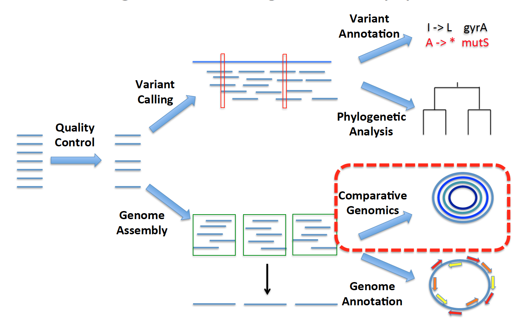

Class 7 – Resistome analysis
===========================

Goal
----

In class6, we learned how to perform basic and functional genome annotation using Prokka and Eggnog. Now we will up the ante and do some more sophisticated comparative genomics analyses!

- First, we will create custom BLAST databases to identify specific antibiotic resistance genes of interest in a set of genomes. 
- Second, We will use the tool [ARIBA - Antimicrobial Resistance Identification By Assembly](https://github.com/sanger-pathogens/ariba/wiki) to identify the complete antibiotic resistome in our genomes by mapping reads to CARD database.
- Then, we will explore Ariba summary reports to gain insights into the types of resistance genes that our genome contains. 



For BLAST and ARIBA, we will be looking at 8 *Klebsiella pneumoniae* genomes from human and environmental sources. Six of these genomes are from [this paper](https://www.pnas.org/content/112/27/E3574), and the other two are sequences from our lab. We are interested in learning more about potential differences in the resistomes of human and environmental isolates. 

Determine which genomes contain KPC genes using [BLAST](https://blast.ncbi.nlm.nih.gov/Blast.cgi)
----------------------------------------------------


Before comparing full genomic content, lets start by looking for the presence of particular genes of interest. Some *K. pneumoniae* harbor a KPC gene that confers resistance to carbapenems, a class of antibiotics of last resort (more information [here](https://www.sciencedirect.com/science/article/pii/S1473309913701907?via%3Dihub) and [here](https://academic.oup.com/jid/article/215/suppl_1/S28/3092084)). 

We will see if any of our samples have a KPC gene, by comparing the genes in our genomes to KPC genes extracted from the antibiotic resistance database ([ARDB](http://ardb.cbcb.umd.edu/)). These extracted genes can be found in the file `blast/data/blast_kleb/ardb_KPC_genes.pfasta`, which we will use to generate a BLAST database.

First, change directories to the working directory and copy class7 directory:

```
wd

cp -r /scratch/epid582w22_class_root/epid582w22_class/shared_data/data/class7 ./ 

cd class7/blast
```

> ***i. Run makeblastdb on the file of KPC genes to create a BLAST database.***

makeblastdb takes as input: 

1) an input fasta file of protein or nucleotide sequences (`data/blast_kleb/ardb_KPC_genes.pfasta`) and 

2) a flag indicating whether to construct a protein or nucleotide database (in this case protein: `-dbtype prot`).

```
makeblastdb -in data/blast_kleb/ardb_KPC_genes.pfasta -dbtype prot

```

> ***ii. BLAST K. pneumoniae protein sequences against our custom KPC database.***

Run BLAST! 

The input parameters are: 

1) query sequences (`-query data/blast_kleb/kpneumo_all.pfasta`), 

2) the database to search against (`-db data/blast_kleb/ardb_KPC_genes.pfasta`), 

3) the name of a file to store your results (`-out KPC_blastp_results.tsv`), 

4) output format (`-outfmt 6`), 

5) e-value cutoff (`-evalue 1e-100`), 

6) number of database sequences to return (`-max_target_seqs 1`) (Note that when using large databases, this might not give you the best hit. See [here](https://academic.oup.com/bioinformatics/advance-article/doi/10.1093/bioinformatics/bty833/5106166) for more details.)


```
blastp -query data/blast_kleb/kpneumo_all.pfasta -db data/blast_kleb/ardb_KPC_genes.pfasta -out KPC_blastp_results.tsv -outfmt 6 -evalue 1e-100 -max_target_seqs 1
```

Use `less` to look at `KPC_blastp_results.tsv`. Which genomes have a KPC gene?

```
less KPC_blastp_results.tsv
```

[Here](http://www.metagenomics.wiki/tools/blast/blastn-output-format-6) is more information about the content for each of the output file columns.

- **Exercise:** In this exercise you will try a different type of blasting – blastx. Blastx compares a nucleotide sequence to a protein database by translating the nucleotide sequence in all six frames and running blastp. Your task is to determine which Enterococcus genomes are vancomycin resistant (VRE, vs. VSE) by blasting against a database of van genes. The required files are located in `blast/data/blast_ent` folder in the `day2pm` directory.

Your steps should be:

1) Concatenate the `data/blast_ent/*.fasta` files (VRE/VSE genomes) into a single file (your blast query file) using the `cat` command.
2) Create a blastp database from `data/blast_ent/ardb_van.pfasta`
3) Run blastx
4) Verify that only the VRE genomes hit the database
5) For extra credit, determine which van genes were hit by using grep to search for the hit gene ID in `data/blast_ent/ardb_van.pfasta`

<details>
  <summary>Solution</summary>
  
```
cd blast/data/blast_ent

# Make sure you are in blast_ent folder
cat *.fasta > VRE_VSE_genomes.fasta

makeblastdb -in ardb_van.pfasta -dbtype prot

blastx -query VRE_VSE_genomes.fasta -db ardb_van.pfasta -out van_blastp_results.tsv -outfmt 6 -evalue 1e-100 -max_target_seqs 1

```
</details>

- **Exercise:** Experiment with the `–outfmt` parameter, which controls different output formats that BLAST can produce. You can use `blastp -help | less` to get more information about the different output formats. You can search for the `-outfmt` flag by typing `/outfmt` and then typing `n` to get to the next one.

Identify antibiotic resistance genes with [ARIBA](https://github.com/sanger-pathogens/ariba) directly from paired end reads
----------------------------------------------------------

ARIBA identifies antibiotic resistance genes by running local assemblies and can also be used for MLST calling. The input is a FASTA file of reference sequences (antibiotic resistance genes) and paired sequencing reads. ARIBA reports which of the reference sequences were found, plus detailed information on the quality of the assemblies and any variants between the sequencing reads and the reference sequences.


[ARIBA](https://github.com/sanger-pathogens/ariba/wiki) (Antimicrobial Resistance Identification By Assembly) is a tool that identifies antibiotic resistance genes by running local assemblies. The way it works is - takes the input paired end reads and maps them to the reference sequences contained in the provided database. If the reads map with sufficient coverage, it then assembles them into contigs and reports presence/absence of an antibiotic reference sequence.

The input is a FASTA file of reference sequences (this can be a custome database of sequences or a public database containing all the preidentified anitibiotic resistance genes) and paired sequencing reads. 
ARIBA reports which of the reference sequences were found, plus detailed information on the quality of the assemblies and any variants between the sequencing reads and the reference sequences.

ARIBA is compatible with various databases and also contains a utility to download these databases - argannot, card, megares, plasmidfinder, resfinder, srst2_argannot, vfdb_core. 

Today, we will be working with the [card](https://card.mcmaster.ca/) database (`ariba/data/CARD/` in your `class7` directory).

Now let's look at the full spectrum of antibiotic resistance genes in our *Klebsiella* genomes!

> ***i. Run ARIBA on input paired-end fastq reads for resistance gene identification.***

The fastq reads are in the `ariba/data/kpneumo_fastq/` directory. 

```
# navigate to ariba directory
wd

cd class7/ariba

# look at ariba commands
less ariba.sbat
```

Explore ARIBA summary reports
-----------------------------

ARIBA has a summary function that summarises the results from one or more sample runs of ARIBA and generates an output report with various level of information determined by the `-preset` parameter. The parameter `-preset minimal` will generate a minimal report showing only the presence/absence of resistance genes whereas `-preset all` will output all the extra information related to each database hit such as reads and reference sequence coverage, variants and their associated annotations (if the variant confers resistance to an antibiotic) etc.

```
# look at ariba output
ls results
ls results/card
ls results/card/*

# make directory for ariba results

ariba summary --preset minimal results/kpneumo_card_minimal_results results/card/*/report.tsv

ariba summary --preset all results/kpneumo_card_all_results results/card/*/report.tsv
```

The ARIBA summary generates three output:

1. `kpneumo_card*.csv` file that can be viewed in your favorite spreadsheet program (e.x. Microsoft Excel).

2. `kpneumo_card*.phandango.{csv,tre}` that allow you to view the results in [Phandango](http://jameshadfield.github.io/phandango/#/). You can drag-and-drop these files straight into Phandango.

Lets copy these  files, along with a metadata file, to the local system using cyberduck or scp.

```
mkdir ~/Desktop/epid582w22_class
mkdir ~/Desktop/epid582w22_class/class7

scp username@greatlakes-xfer.arc-ts.umich.edu:/scratch/epid582w22_class_root/epid582w22_class/username/class7/ariba/results/kpneumo_card* ~/Desktop/epid582w22_class/class7
scp username@greatlakes-xfer.arc-ts.umich.edu:/scratch/epid582w22_class_root/epid582w22_class/username/class7/ariba/data/kpneumo_source.tsv ~/Desktop/epid582w22_class/class7
scp username@greatlakes-xfer.arc-ts.umich.edu:/scratch/epid582w22_class_root/epid582w22_class/username/class7/ariba/data/mlst_typing/kpneumo_mlst.tsv ~/Desktop/epid582w22_class/class7
```

Drag and drop these two files onto the [Phandango](http://jameshadfield.github.io/phandango/#/) website. What types of resistance genes do you see in these *Klebsiella* genomes? 

Now, fire up RStudio and read in the ARIBA full report `kpneumo_ariba_all_results.csv` so we can take a look at the results.

```
# Read in data
ariba_full  = read.csv(file = '~/Desktop/micro612/day2pm/kpneumo_card_all_results.csv', row.names = 1)
rownames(ariba_full) = gsub('_1|_R1|/report.tsv|card/|results/','',rownames(ariba_full))

# Subset to get description for each gene
ariba_full_match = ariba_full[, grep('match',colnames(ariba_full))]

# Make binary for plotting purposes
ariba_full_match[,] = as.numeric(ariba_full_match != 'no')

# Make a heatmap!

# install pheatmap if you don't already have it installed 
#install.packages('pheatmap')

# load pheatmap
library(pheatmap)

# load metadata about sample source
annots = read.table('~/Desktop/micro612/day2pm/kpneumo_source.tsv',row.names=1)
colnames(annots) = 'Source'

# plot heatmap
pheatmap(ariba_full_match,annotation_row = annots)
```

Bacteria of the same species can be classified into different sequence types (STs) based on the sequence identity of certain housekeeping genes using a technique called [multilocus sequence typing (MLST)](https://en.wikipedia.org/wiki/Multilocus_sequence_typing). The different combination of these house keeping sequences present within a bacterial species are assigned as distinct alleles and, for each isolate, the alleles at each of the seven genes define the allelic profile or sequence type (ST). Sometimes, different sequence types are associated with different environments or different antibiotic resistance genes. We want to know what sequence type(s) our genomes come from, and if there are certain ones that are associated with certain sources or certain antibiotic resistance genes. 

We already pre-ran Ariba MLST on all 8 of our *K. pneumonia* genomes. Use the MLST results kpneumo_mlst.tsv that we previously downloaded to add a second annotation column to the heatmap we created above to visualize the results. 

Go to your R studio and overlay MLST metadata as an additional row annotation to your previous heatmap

```
#read in MLST data
annots_mlst = read.table('~/Desktop/epid582w22_class/class7/kpneumo_mlst.tsv',row.names=1)

#make sure order of genomes is the same as source annotation
annots_mlst$ST = annots_mlst[row.names(annots),]

#paste together annotations
Row_annotations <- cbind(annots, annots_mlst) 

#change from numeric to character, so that heatmap doesn't treat ST as continuous variable
Row_annotations$ST = as.character(Row_annotations$ST)

# Assign colors to Sequence Types
annoCol <- list(ST=c("11"="blue", "221"="red", "230"="orange", "258"="grey"))

#create new heatmap with source and mlst
pheatmap(ariba_full_match,annotation_row = Row_annotations, annotation_colors = annoCol)
```


The commands and steps that were used for MLST typing are given below:

<details>
  <summary>Solution</summary>

**Dont run this exercise**

Steps:
1. Check if you have an MLST database for your species of interest using `ariba pubmlstspecies`.
2. Download your species MLST database. You can look at the manual or run the command `ariba pubmlstget -h` to help figure out how to download the correct MLST database. I would suggest downloading it to the `data` directory. 
3. Copy the `ariba.sbatch` file to a new file called `mlst.sbatch`.
4. Modify the `mlst.sbatch` script in the following ways:
    1. Change the database directory to the _K. pneumoniae_ MLST database you just downloaded.
    1. Change the `mkdir` line to make a `results/mlst` directory.
    1. Modify the output directory `outdir` line: Change `card` to `mlst`.
5. Submit the `mlst.sbatch` script. It should take about 7 minutes to run.
6. Once the run completes, run `scripts/summarize_mlst.sh results/mlst` to look at the MLST results. If you want, you can save it to its own file. What sequence types are present? 


```
# Make sure you are in ariba directory under day2pm folder and running the below commands from ariba directory.
d2a
cd ariba

# Check if you have an mlst database for your species of interest
ariba pubmlstspecies

# Download your species mlst database
ariba pubmlstget "Klebsiella pneumoniae" data/MLST_db

# Set ARIBA database directory to the get_mlst database that we just downloaded.
db_dir=data/MLST_db/ref_db/

# Run ariba mlst with this database
samples=$(ls data/kpneumo_fastq/*1.fastq.gz) #forward reads

# Generate mlst folder under results folder to save ariba MLST results
mkdir results/mlst_typing

# Run for loop, where it generates ARIBA command for each of the forward end files.
for samp in $samples; do   
samp2=${samp//1.fastq/2.fastq} #reverse reads   
outdir=results/mlst_typing /$(echo $samp | cut -d/ -f3 | sed 's/_.*1.fastq.gz//g')
echo "Results will be saved in $outdir"
echo "Running: ariba run --force $db_dir $samp $samp2 $outdir  #ariba command "
ariba run --force $db_dir $samp $samp2 $outdir  #ariba command 
done

# Once the run completes, run summarize_mlst.sh script to print out mlst reports that are generated in current directory
bash scripts/summarize_mlst.sh results/mlst

```
</details>


