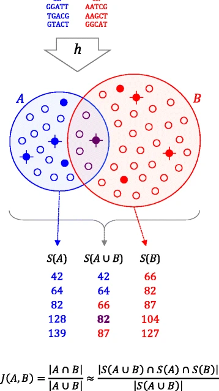

Class 8 – Data download and genome comparison
=============================================

Goal
----

- In this class, we will learn about NCBI public database and how to download entire datasets pertianing to a research study using SRAtoolkit.
- We will then do a quick genomic comparison of the downloaded dataset using Mashtree. 
- Finally, we will visualize our rough phylogeny and associated meta-data in iTOL

#### Set up conda environment

We will be setting up two environments for the class today. class8_sratools will install SRA toolkit that we will use to extract metadata information from NCBI database and download the samples.  We will then perform a quick genome comparison with Mashtree using class8_mashtree environment.

Lets create two seperate environments class8_sratools and class8_mashtree

```
# class8_sratools environment
conda create -n class8_sratools -c bioconda sra-tools=2.10.0 entrez-direct

# class8_mashtree environment
conda create -n class8_mashtree -c bioconda mashtree

conda activate class8_sratools

esearch -h

fasterq-dump -h

conda deactivate

conda activate class8_mashtree

mashtree -h
```
If you can see the help menu for each of these tools then you are all set for today's analysis.

### Databases hosted by NCBI


The National Center for Biotechnology Information (NCBI) provides bioinformatics tools and hosts approximately 40 online literature and molecular biology databases. Some of the most used and popular databases are PubMed, Genbank, SRA etc. MOst of the NCBI databases are linked together through unique accession numbers and therfore provide a comprehensive resource for biomedical research. For this class, we will be focusing on SRA - Sequence read archive database which is the largest publicly available repository of high throughput raw sequencing and alignment data. 

SRA can be searched independently, or SRA records associated with a specific BioProject or BioSample accessions are linked from their respective records.

Each SRA record is given a unique accession number based on the source database (SRA, European Bioinformatics Institute (EBI), or DNA Data Bank of Japan (DDBJ)), and the type of record (Study, Sample, Experiment, Run):

- Study (e.g., the SRA record associated with a specific BioProject): SRP#, ERP#, or DRP#
- Sample (e.g.,the SRA record associated with a specific BioSample): SRS#, ERS#, or DRS#
- Experiment (e.g., the SRA record for a specific experiment or run(s)): SRX#, ERX#, or DRX#
- Run (e.g., the SRA record for a specific run): SRR#, ERR#, or DRR#

A BioProject is a collection of biological data related to a large-scale research effort such as genome sequencing, epigenomic analyses, genome-wide association studies (GWAS) and variation analyses. it provides a single place to find links to the diverse data types generated for that research project. Whereas, the BioSample database contains descriptions of biological source materials used in experimental assays. Each Biosample under a Bioproject can be accessed through a SRA Run accession number that lets you download the sequencing data as well as the metadata associated with it.

### Get the sample IDs associated with the Bioproject of interest

For today's lab we will download and analyze genomes from a previously published study examining the genetic diversity of *Klebsiella pnuemoniae* isolated from different sources ([Holt et al., PNAS, 2015](https://www.pnas.org/content/112/27/E3574.full)). In particular, we will perform the following tasks.

1. Retrieve sample IDs from NCBI using the Bioproject as our query
2. Subset to the samples to a smaller subset of interest
3. Download fastq files for the samples of interest from the sra
4. Run mashtree to construct a phylogeny based on kmer distances among the sequenced genomes
5. Perform assemblies on our downloaded genomes
6. Run AMRFinderPlus to determine the antibiotic resistance gene content of each genome
7. Visualize the mashtree phylogeny and meta-data using iTOL

To start, let's get the sample IDs associated with the Bioproject. It is common for the set of genomes associated with a study or manuscript to all fall under a single bioproject, and that is the case here ([PRJEB2111](https://www.ncbi.nlm.nih.gov/bioproject/PRJEB2111)). 

To get a list of sample IDs associated with this bioproject we will use tools provided by NCBI. In particular, NCBI provides a suite of command line tools called Entrez Direct also known as E-utilities to access the metadata stored in its various databases. The three main tools of E-utilities are - esearch, esummary and xtract that lets you query any of the NCBI databases and extract the metadata associated with the query. The query can be anything(Bioproject, Biosample, SRA accession, Genbank assembly accession). 

Here is the command that we used to extract metadata information for the above mentioned research study.

```
#Go to class working directory
wd

#Copy over files
cp -r ../shared_data/data/class8/ .

#Enter class 8 directory
cd class8

#Activate conda environment
conda activate class8_sratools

#Run esearch command to pull sample meta-data for bioproject
esearch -h

esearch -db sra -query PRJEB2111 | esummary | xtract -pattern DocumentSummary -element Experiment@acc,Run@acc,Platform@instrument_model,Sample@acc > PRJEB2111-info.tsv
```

The Bioproject associated with the study is PRJEB2111. Esearch will return a Edirect object for your query that is then summarized by esummary in XML format. Xtract is then used to extract the metadata elements from this XML format.


Download datasets from NCBI using SRA toolkit
------------------------------------------------

In principle we could download the entire dataset (i.e. all of the IDs associated with the bioproject), but to make things a little more manageable I have selected a subset of interest by going through the [supplementary materials](https://www.pnas.org/highwire/filestream/619654/field_highwire_adjunct_files/1/pnas.1501049112.sd01.xlsx) in the manuscript and selecting ~30 genomes that are a mix of human infection, human carraige, bovine infection and bovine colonization.

Next, we will use a new trick to subset the file we downloaded to contain entries only for the genomes of interest. In particular, we will apply grep to pull lines from PRJEB2111-info.tsv that match any of the genome IDs in the file genome_IDs_to_download.

```
grep -f genome_IDs_to_download PRJEB2111-info.tsv > PRJEB2111-info_subset.tsv
```

We will now use fasterq-dump tool available from SRA toolkit to download sequencing data for each of the SRA runs that we just saved to PRJEB2111-info_subset.tsv file. 

*This is how the data was downloaded. We have already downloaded the data in /scratch/epid582w24_class_root/epid582w24_class/shared_data/data/class8/fastq_download*

We have put the commands to download the genomes of interest in the sbat script download.sbat. Let's look at the code that is doing the work for us:

```
#Make output directory
mkdir fastq_download

for accession in $(cut -f2 PRJEB2111-info_subset.tsv);
do

        printf "\n  Working on: ${accession}\n\n";
        fasterq-dump -O fastq_download/ ${accession};
        
done
```

In essence, we have seen this before, but there are two new concepts that are worth highlighting - the use of () and {}.

1. () - The commands inside parentheses will be execute. So in the example above the loop list gets the second column of the file PRJEB2111-info_subset.tsv, which contains the accession IDs we want to download
2. {} - The curly braces are used to indicate where the name of a variable beging and end. They are not always neccesary, but can prevent problems from occuring when it is not obvious where a variable name ends


The above command is a bit drawn out for illustrative purposes. However, in practice we want to take advantage of the computing power of Great Lakes and the existance of multi-processor nodes. To do this we can use the below shortcut which downloads the sample IDs of interest in parallel!

```
cut -f2 PRJEB2111-info_subset.tsv | parallel fasterq-dump {}
```


Compare genomes using Mashtree
------------------------------

Now that we have downloaded the genomes of interest, we would like to construct a phylogeny to quantify the evolutionary relationships among the sequenced genomes. In later sessions we will learn how to perform rigorous phylogenetic analysis for various genomic epidemiology applications. However, pipelines to detect genome-wide variants and use them to perform phylogenetic inference tend to be quite computationally expensive. Therefore, in cases where a rough estimation of the phylogeny is sufficient, we use a different suite of methods. Examples where a rough estimation of the phylogeny is appropriate are:

1. You have sequenced a set of genomes and would like to get a sense of the genetic diversity before proceeding
2. You know that you have a very diverse set of genomes, and would like to visualize their relative relationships

Here, we have a diverse set of Klebsiella genomes and are primarily interested in the rough relationships among them, so we will use one of the quick and dirty methods! The tool that we are going to use is called mashtree. Mashtree performs the following steps:

1. Compute pairwise distances among each pair of genomes based on kmer distances
2. Constructs a Neighbor Joining tree, which is a tree building algorithm that takes as input a distance matrix

The kmer distances that are being computed are called Mash distances. Mash stands for MinhASH which is the name of algorithm that this disctance estimation is based on. In the min-hash algorithm, all kmers are recorded and transformed into integers using hashing and a Bloom filter (Bloom, 1970). These hashed kmers are sorted and only the first several kmers are retained. The kmers that appear at the top of the sorted list are collectively called the sketch. Any two sketches can be compared by counting how many hashed kmers they have in common. Because min-hash creates distances between any two genomes, min-hash values can be used to rapidly cluster genomes into trees using the neighbor-joining algorithm. 





*We have already run mashtree for you, but here is how we did it

```
#Activate the environment so we can run mashtree
conda activate class8_mashtree

#Edit the .sbat file to put in your email address
nano mashtree.sbat

#Submit the job to the cluster
sbatch mashtree.sbat
```


Determine antibiotic resistance gene content with AMRFinderPlus
---------------------------------------------------------------
Last class we ran AMRFinderPlus on a subset of the genomes in this dataset and parsed the output to determine the number of antibiotic subclasses each genome encodes resistance to. Here we will run on the larger genomic dataset that we downloaded, and then run our handy shell script from last class!

*We have run AMRFinderPlus, but here is how we did it*

To save time we have run AMRFinderPlus for you, but want to take some time to look at how this was done. The commands are in amrfinder.sbat, but let's look at the code that is actually running AMRFinderPlus inside the script:

```
# List fasta files in the directory and save the filenames into the variable samples. 
fasta_files=$(ls genome_assembly/*.fasta)

# Make directory for amrfinder results
mkdir amr_finder_results

outdir="amr_finder_results"

# Run for loop, where it generates amrfinder command for each assembly.
for fasta in $fasta_files;
do
        # Print out name of current fasta file
        echo $fasta

        # Create a prefix for the amrfinder results by trimming off .fasta from the sample fasta file
        prefix=$(echo ${fasta//.fasta/} | cut -d/ -f2)

        # Run amrfinder command
        amrfinder --plus --output $outdir/$prefix\.txt -n $fasta --mutation_all $outdir/$prefix\_mutation_report.tsv --organism Klebsiella_pneumoniae

done
```

Most of what's going on here we have seen before. However, there are a couple of new concepts that are important to highlight:

1. () - We again are using the parentheses to put the results of a Unix command in a variable. In this case, we are getting the fasta files for our genome assemblies.
2. Getting genome name - When running AMRFinderPlus we need to provide output files. To do this for each genome, we want to use the name of the genome, but chop off ".fasta" from the end and the path to the fasta file from the beginning. To do this we first use a search and replace function to replace ".fasta" with "" (i.e. nothing). Next, we pipe that output to a cut command, where we split by "/" and take the second item, which gets rid of the directory name.

Lastly, we ran a modified version of our shell script from last week to determine the number of antibiotic classes each genome encodes resistance to, and output in a format that works for iTOL.

```

#Run our shell script and use >> to append the output to the end of our itol barplot file
bash amr_finder_res_summary_batch.sh amr_finder_results >> itol_files/dataset_simplebar_amr_count.txt
```

Visualize our tree and metadata using iTOL
------------------------------------------
Now we are ready to put it all together and visualize the tree we built from our downloaded genomes, and overlay some meta-data on resistance gene content and sample type. In subsequent sessions we will learn how to visualize phylogenies and meta-data in R. This is preferable for a few reasons:
1. You can avoid manual steps and therefore perform reproducible analyses
2. You often want to visualize similar types of data on a tree (e.g. location/facility of isoaltion), so it would be nice to automate this

However, since we haven't gotten into R yet, we are going to use another commonly used tool for making pretty trees called [iTOL](https://itol.embl.de/). iTOL is actually quite nice, and allows you to easily customize your tree visualization in a drag and drop interface. In addition, it allows you to add annotations to your tree in a semi-automated way by creating these annotation files that can be drag and dropped onto your tree ([template files](https://itol.embl.de/help/templates.zip)). iTOL has lot's of functionality, but since I am a novice, I will just walk you through some basics :).

To get ready for iTOL bring the following files to your computer using cyberduck:
1. dataset_simplebar_amr_count.txt - Located in the itol_files directory, this contains the AMR gene counts for each genome to be plotted as a barplot
2. dataset_symbols_inf_status.txt - Located in the itol_files directory, this contains information on the origin of each isolate, that I got from the supplementary material in the manuscript
3. mashtree_accurate.dnd - The newick formatted phylogenetic tree created by Mashtree

Now, do the following to view our tree:
1. Go to the [iTOL](https://itol.embl.de/) website and click on Upload on the top menu
2. Drag your tree file
3. Drag your annotation files
4. Enjoy!

A couple of things we notice by viewing our data this way:
1. Human and bovine isolates are generally in genetically distinct groups, suggesting niche adaptation
2. Human infections form different clusters on the tree, indicating multiple lineages of Klebsiella capable of causing human infections
3. Human carrier and infection isolates can be seen clustered together, suggesting that a given strain can either colonize or cause infection
4. The number of antibiotic resistance genes appears on average larger in human associated isolates, which is consistent with the results in the manuscript.

